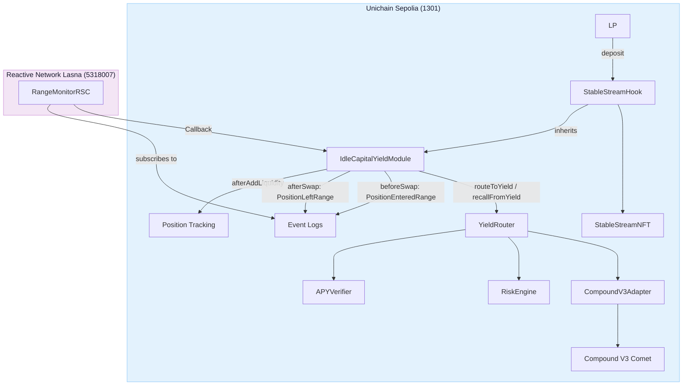

# StableStream

[](https://soliditylang.org)
[](https://book.getfoundry.sh)
[](LICENSE)
[](https://github.com/stablestream/stablestream)
[](https://sepolia.uniscan.xyz)

Yield infrastructure for out-of-range concentrated USDC liquidity. Detects idle positions through Uniswap v4 hooks, routes capital to Compound V3, and recalls it just-in-time before the next swap -- fully automated via a Reactive Network RSC with no off-chain infrastructure.

## Deployments

| Contract | Chain | Address |
|---|---|---|
| `StableStreamHook` | Unichain Sepolia (1301) | [`0xDB23B8Ff772fC1e29EB35a4BECe17f6D1a9A86C0`](https://sepolia.uniscan.xyz/address/0xDB23B8Ff772fC1e29EB35a4BECe17f6D1a9A86C0) |
| `YieldRouter` | Unichain Sepolia (1301) | [`0xc69a63B6FbB684f1aC47BDe6613ed49B66A9feeA`](https://sepolia.uniscan.xyz/address/0xc69a63B6FbB684f1aC47BDe6613ed49B66A9feeA) |
| `CompoundV3Adapter` | Unichain Sepolia (1301) | [`0x67fD183808Dc4B886b20946456F3fD81f488D2d7`](https://sepolia.uniscan.xyz/address/0x67fD183808Dc4B886b20946456F3fD81f488D2d7) |
| `StableStreamNFT` | Unichain Sepolia (1301) | [`0x6f265EB778C44118cfc8484cA44A2Ea216ea998C`](https://sepolia.uniscan.xyz/address/0x6f265EB778C44118cfc8484cA44A2Ea216ea998C) |
| `RangeMonitorRSC` | Reactive Network Lasna (5318007) | [`0xa86591459C15d12F13AbaDf0d78Ec56F3e920a80`](https://lasna.reactscan.net/address/0xa86591459C15d12F13AbaDf0d78Ec56F3e920a80) |

**Frontend:** https://stablestream.vercel.app

---

## Problem

Concentrated liquidity positions in stablecoin pairs sit idle when the price moves out of range. For tight USDC ranges this can last hours or days with no yield. Standard solutions need either active monitoring or keeper bots.

## Architecture



## System Lifecycle

| Step | Trigger | Actor |
|---|---|---|
| 1. Deposit | `deposit(amount, tickLower, tickUpper)` | LP |
| 2. NFT minted | `afterAddLiquidity` -> `StableStreamNFT.mint()` | Hook |
| 3. Price exits range | `afterSwap` emits `PositionLeftRange` | Hook |
| 4. Capital routed | RSC calls `routeToYield` -> USDC -> Compound V3 | RSC |
| 5. Price re-enters | `beforeSwap` emits `PositionEnteredRange` | Hook |
| 6. JIT recall | RSC calls `recallFromYield` -> USDC back to pool | RSC |
| 7. Withdraw | `withdraw(positionId)` -> capital + yield | LP |

---

## IdleCapitalYieldModule

`IdleCapitalYieldModule` is an abstract Solidity contract that provides reusable idle-capital yield routing for any Uniswap v4 hook. Inherit it in your hook to get position tracking, four callback hooks, and RSC-triggered yield routing -- zero product coupling.

### Quick integration (11 lines of Solidity)

```solidity
contract MyHook is IdleCapitalYieldModule {
    constructor(IPoolManager pm, YieldRouter router, address asset, address owner)
        IdleCapitalYieldModule(pm, router, asset, owner)
    {}
}
```

See [`docs/INTEGRATION_GUIDE.md`](docs/INTEGRATION_GUIDE.md) for the full walkthrough.

### What the module provides

| Feature | Inherited behavior |
|---|---|
| Position tracking | `deposit()`, `withdraw()`, `getPosition()`, `getOwnerPositions()` |
| Hook callbacks | `afterAddLiquidity`, `beforeRemoveLiquidity`, `beforeSwap`, `afterSwap` |
| Yield routing | `routeToYield()`, `recallFromYield()` -- RSC-triggered |
| Dynamic fees | `getDynamicFee()` -- scales fee with deployment ratio |
| Lifecycle hooks | `_onPositionOpened()`, `_onPositionClosed()` -- override for product logic |
| Rate limiting | Cooldown + per-block callback caps inherited from module |

### Custom errors

| Error | Parameters | Reverts when... |
|---|---|---|
| `NotOwnerOfPosition` | `bytes32 positionId` | Caller does not own the position |
| `PositionAlreadyExists` | `bytes32 positionId` | Position ID collision on deposit |
| `PositionNotFound` | `bytes32 positionId` | Position ID does not exist |
| `PositionAlreadyClosed` | `bytes32 positionId` | Position was already withdrawn |
| `PositionCurrentlyInRange` | `bytes32 positionId` | Attempt to route capital for an in-range position |
| `PositionAlreadyRouted` | `bytes32 positionId` | Capital already deployed to yield |
| `PositionNotRouted` | `bytes32 positionId` | No capital to recall |
| `RoutingCooldownActive` | `bytes32 positionId, uint256 unlocksAt` | Position is rate-limited on routing |
| `UnauthorizedRoutingCaller` | -- | Caller is not the authorized RSC |
| `ZeroAmount` | -- | Zero-value deposit or action |
| `CapitalInYield` | `bytes32 positionId` | Direct removeLiquidity blocked while capital in yield |

Note: `NotOwnerOfPosition`, `PositionAlreadyExists`, `PositionNotFound`, `PositionAlreadyClosed`, `CapitalInYield`, `ZeroAmount`, and `UnauthorizedRoutingCaller` are shared with `StableStreamHook` via the inherited module.

### Interface

```solidity
interface IIdleCapitalYieldModule {
    event PositionOpened(bytes32 indexed positionId, address indexed owner, int24 tickLower, int24 tickUpper);
    event PositionLeftRange(bytes32 indexed positionId, int24 tick);
    event PositionEnteredRange(bytes32 indexed positionId, int24 tick);
    event PositionExited(bytes32 indexed positionId, address indexed owner, uint256 totalWithdrawn);
    event CapitalRouted(bytes32 indexed positionId, address indexed yieldSource, uint256 amount);
    event CapitalRecalled(bytes32 indexed positionId, address indexed yieldSource, uint256 amount);

    function deposit(IPoolManager.ModifyLiquidityParams calldata params, bytes calldata hookData) external payable returns (bytes32 positionId);
    function withdraw(bytes32 positionId) external;
    function routeToYield(bytes32 positionId) external;
    function recallFromYield(bytes32 positionId) external;
    function getDynamicFee(int24 tick) external view returns (uint160 sqrtPriceX96);
    function getPosition(bytes32 positionId) external view returns (TrackedPosition memory);
    function getOwnerPositions(address owner) external view returns (bytes32[] memory);
    function setReactiveContract(address rsc) external;
}
```

---

## StableStreamHook (reference implementation)

`StableStreamHook` is a production-grade hook built on `IdleCapitalYieldModule`. It adds ERC-721 position receipts, multi-token whitelisting, and `onlyReactive` routing gating. Use it as-is or as a template for your own hook.

| Function | Description |
|---|---|
| `deposit(amount, tickLower, tickUpper)` | Add USDC as concentrated liquidity; mint NFT |
| `withdraw(positionId)` | Remove liquidity + yield; burn NFT |
| `routeToYield(positionId)` | RSC-triggered: idle liquidity to Compound V3 |
| `recallFromYield(positionId)` | RSC-triggered: Compound V3 back to pool |
| `setReactiveContract(rsc)` | Owner only |

---

## Reactive Network Integration

`RangeMonitorRSC` on Reactive Network Lasna subscribes to three events on the module interface:

| Event | Action |
|---|---|
| `PositionLeftRange(bytes32,int24)` | `routeToYield` callback |
| `PositionEnteredRange(bytes32,int24)` | `recallFromYield` callback (JIT) |
| `CapitalRouted(bytes32,address,uint256)` | Observational only |

### Rate limiting

| Parameter | Default | Setter |
|---|---|---|
| `MAX_CALLBACKS_PER_BLOCK` | 5 | `setMaxCallbacksPerBlock(uint256)` |
| `POSITION_COOLDOWN_BLOCKS` | 10 | `setPositionCooldownBlocks(uint256)` |

Positions exceeding the per-block cap queue as FIFO, drained via `flushQueue(maxCount)`. JIT recall bypasses rate limits.

### RSC deployment

The RSC cannot be deployed via `forge create` or `forge script`. Reactive Network precompiles revert during simulation. Use `cast send --create`:

```bash
BYTECODE=$(forge inspect RangeMonitorRSC bytecode)

ARGS=$(cast abi-encode "constructor(address,address,uint256)" \
  "$HOOK_ADDRESS" "$OWNER_ADDRESS" "$ORIGIN_CHAIN_ID")

cast send \
  --rpc-url "$REACTIVE_RPC" \
  --private-key "$PRIVATE_KEY" \
  --value "0.3ether" \
  --create "${BYTECODE}${ARGS#0x}"
```

The `0.3 ETH` funds outbound callbacks. A successful deployment produces 3 subscription logs in the receipt.

---

## Unichain Integration

### Hook permissions

The hook address is CREATE2-mined so its lower 14 bits encode the required permission flags.

| Callback | Purpose |
|---|---|
| `afterAddLiquidity` | Mint NFT, record position |
| `beforeRemoveLiquidity` | Block direct removal of managed positions |
| `beforeSwap` | JIT recall signal + dynamic fee |
| `afterSwap` | Detect range crossings |

### Dynamic fees

`DynamicFeeModule` scales swap fees with the fraction of pool capital deployed to yield sources.

```
fee = BASE_FEE + (YIELD_PREMIUM x yieldRatio)
```

Returned from `beforeSwap` using `LPFeeLibrary.DYNAMIC_FEE_FLAG`.

### EIP-1153 transient storage

The `pendingRecall` flag uses `TSTORE`/`TLOAD` instead of persistent storage, saving ~22,000 gas per flag versus cold `SSTORE`. The RSC's per-position cooldown provides cross-transaction idempotency.

### Pool configuration

| Parameter | Value |
|---|---|
| Chain | Unichain Sepolia (1301) |
| Token0 | ETH (native, `address(0)`) |
| Token1 | USDC `0x31d0220469e10c4E71834a79b1f276d740d3768F` |
| Fee tier | Dynamic |
| Tick spacing | 10 |
| Initial sqrtPrice | 2^96 (tick = 0) |

---

## Contracts

### YieldRouter

Routes USDC to the highest risk-adjusted yield source.

| Feature | Detail |
|---|---|
| Multi-source routing | Fixed array, `MAX_SOURCES = 8` |
| APY anomaly detection | `APYVerifier` -- rolling TWAP rejects >2x trailing average |
| Risk-weighted selection | `RiskEngine` -- owner-assigned risk scores |
| Emergency exit | `withdrawAll()` -- drains all sources in one tx |

### RangeMonitorRSC

Reactive Network automation contract. Monitors hook events, dispatches callbacks.

| Feature | Detail |
|---|---|
| Subscriptions | 3 event topics on `IIdleCapitalYieldModule` |
| Rate limiting | Per-block cap + per-position cooldown |
| Overflow queue | `bytes32[]` FIFO |
| JIT bypass | `recallFromYield` skips rate limit |

### Adapters

| Adapter | Protocol | Status |
|---|---|---|
| `CompoundV3Adapter` | Compound V3 Comet | Live (USDC market) |
| `AaveV3Adapter` | Aave V3 | Ready, pending Unichain Sepolia support |
| `NativeStakeAdapter` | ETH native staking | Ready |

### IYieldSource interface

Every yield adapter implements `IYieldSource` so `YieldRouter` can treat Compound, Aave, and future sources identically.

```solidity
interface IYieldSource {
    function deposit(uint256 amount) external returns (uint256 shares);
    function withdraw(uint256 amount) external returns (uint256 received);
    function withdrawAll() external returns (uint256 received);
    function balanceOf(address account) external view returns (uint256);
    function currentAPY() external view returns (uint256);
    function asset() external view returns (address);
    function maxDeposit() external view returns (uint256);
}
```

All amounts are in the underlying asset (USDC at 6 decimals). APY is in basis points (10,000 = 100%). Implementations return 0 from `currentAPY()` when the rate cannot be fetched rather than reverting, so `YieldRouter` can always compare sources safely.

---

## Events

### Hook events

| Event | Indexed | Consumer |
|---|---|---|
| `PositionOpened(bytes32,address,int24,int24)` | positionId | RSC |
| `PositionLeftRange(bytes32,int24)` | positionId | RSC |
| `PositionEnteredRange(bytes32,int24)` | positionId | RSC |
| `CapitalRouted(bytes32,address,uint256)` | positionId | Observational |
| `CapitalRecalled(bytes32,address,uint256)` | positionId | Observational |
| `PositionExited(bytes32,address,uint256)` | positionId | Observational |
| `StablecoinWhitelisted(address,address)` | token | Off-chain |
| `NFTContractSet(address)` | nftContract | Off-chain |

### YieldRouter events

| Event | Indexed | Description |
|---|---|---|
| `SourceRegistered(address)` | source | New yield source added |
| `SourceRemoved(address)` | source | Yield source removed |
| `Routed(address,uint256)` | source | Capital routed to source |
| `Recalled(address,uint256,uint256)` | source | Capital recalled from source |
| `Switched(address,address,uint256)` | from, to | Active source changed |
| `AuthorizedCallerUpdated(address,address)` | previous, next | Caller changed |
| `RiskProfileSet(address,uint16,uint8)` | source | Risk profile updated |
| `APYSnapshotSeeded(address,uint256)` | source | APY seeded |

### RSC events

| Event | Indexed | Description |
|---|---|---|
| `ReactTriggered(bytes32,string,uint256)` | positionId | RSC reacted to event |
| `PositionQueued(bytes32,uint256)` | positionId | Position queued for rate limit |
| `QueueFlushed(uint256)` | -- | Overflow queue drained |

---

## Custom Errors

### YieldRouter

| Error | Parameters | Reverts when... |
|---|---|---|
| `Unauthorized` | -- | Caller lacks the required role |
| `SourceAlreadyRegistered` | `address source` | Duplicate yield source registration |
| `SourceNotRegistered` | `address source` | Source not in the active list |
| `MaxSourcesReached` | -- | `MAX_SOURCES` (8) exceeded |
| `NoActiveSources` | -- | No yield sources registered |
| `ZeroAmount` | -- | Zero-value operation |
| `InsufficientBalance` | `uint256 requested, uint256 available` | Not enough capital to route |

### IYieldSource (all adapters)

| Error | Parameters | Reverts when... |
|---|---|---|
| `ExceedsCapacity` | `uint256 requested, uint256 available` | Deposit/withdrawal exceeds adapter cap |
| `ZeroAmount` | -- | Zero-value deposit/withdrawal |

### NativeStakeAdapter

| Error | Parameters | Reverts when... |
|---|---|---|
| `SlippageExceeded` | `uint256 expectedMin, uint256 actual` | ETH withdrawal slippage exceeds tolerance |
| `EthFloorPriceNotSet` | -- | Minimum ETH floor price not configured |

### StableStreamNFT

| Error | Parameters | Reverts when... |
|---|---|---|
| `OnlyHook` | -- | Caller is not the hook contract |

### YieldSource adapters (shared)

| Error | Parameters | Reverts when... |
|---|---|---|
| `Unauthorized` | -- | Caller not authorized for deposit/withdraw |

---

## Access Control

| Contract | Role | Functions |
|---|---|---|
| `IdleCapitalYieldModule` | Owner | `setReactiveContract`, `setPositionCooldownBlocks`, `setMaxCallbacksPerBlock` |
| `StableStreamHook` | Owner (inherited) | Overridden admin functions |
| `YieldRouter` | Owner | `registerSource`, `removeSource`, `emergencyWithdrawAll`, `setRiskProfile`, `setAuthorizedCaller`, `seedAPYSnapshot` |
| `YieldRouter` | Authorized | `routeToYield`, `recallAllFromYield` |
| `RangeMonitorRSC` | Owner | `setMaxCallbacksPerBlock`, `setPositionCooldownBlocks`, `transferOwnership`, `withdrawEth` |
| `RangeMonitorRSC` | Reactive Network | `react` |
| Adapters | Owner | `setAuthorizedCaller`, `setMockAPY`, `setMaxCapacity` |
| Adapters | Authorized | `deposit`, `withdraw`, `withdrawAll` |

---

## CREATE2 Salt Derivation

The hook address must have specific lower 14 bits set to declare its permission flags. The deploy script brute-forces a salt to find an address that matches:

```solidity
uint160 constant HOOK_FLAGS =
    Hooks.AFTER_ADD_LIQUIDITY_FLAG |      // 1 << 10 = 0x0400
    Hooks.BEFORE_REMOVE_LIQUIDITY_FLAG |  // 1 << 9  = 0x0200
    Hooks.BEFORE_SWAP_FLAG |              // 1 << 7  = 0x0080
    Hooks.AFTER_SWAP_FLAG;                // 1 << 6  = 0x0040

address foundryFactory = 0x4e59b44847b379578588920cA78FbF26c0B4956C;
bytes32 salt;
address hookAddress;
for (uint256 i = 0; i < 160_000; i++) {
    salt = bytes32(i);
    hookAddress = address(uint160(uint256(
        keccak256(abi.encodePacked(
            bytes1(0xff), foundryFactory, salt, keccak256(hookCreationCode)
        ))
    )));
    if (uint160(hookAddress) & 0x3FFF == uint160(HOOK_FLAGS)) break;
}
```

Foundry routes `new Contract{salt: s}()` through a deterministic factory at `0x4e59b4...` that follows the standard CREATE2 scheme. The loop increments a uint256 salt until the computed address AND 0x3FFF matches `HOOK_FLAGS`. The search typically converges within 100,000 iterations.

---

## Repository Structure

```
src/
├── core/
│   ├── IdleCapitalYieldModule.sol       # Reusable yield-routing base module
│   ├── YieldRouter.sol                  # Multi-source yield routing
│   ├── interfaces/
│   │   ├── IIdleCapitalYieldModule.sol  # Module interface for RSC
│   │   └── IYieldSource.sol            # Yield adapter interface
│   ├── adapters/
│   │   ├── CompoundV3Adapter.sol        # Compound V3 Comet
│   │   ├── AaveV3Adapter.sol            # Aave V3
│   │   └── NativeStakeAdapter.sol       # ETH native staking
│   ├── libraries/
│   │   ├── APYVerifier.sol              # TWAP anomaly detection
│   │   ├── DynamicFeeModule.sol         # Yield-ratio swap fees
│   │   ├── RangeCalculator.sol          # Tick math and range detection
│   │   ├── RiskEngine.sol               # Risk-weighted source scoring
│   │   ├── TransientStorage.sol         # EIP-1153 TSTORE/TLOAD wrapper
│   │   └── YieldAccounting.sol          # Per-position yield tracking
│   └── reactive/
│       └── RangeMonitorRSC.sol          # Reactive Network automation

app/                                      # Application-layer contracts
├── StableStreamHook.sol                 # Reference hook implementation
├── StableStreamNFT.sol                  # ERC-721 position receipt
└── script/
    ├── Deploy.s.sol                     # Full protocol deployment
    ├── DeployRSC.s.sol                  # RSC deployment
    └── InitPool.s.sol                   # Pool initialisation

test/                                    # 161 tests across 11 suites
  core/
    MinimalHook.t.sol                    # Module reusability proof
frontend/                                # Next.js interface
docs/
  INTEGRATION_GUIDE.md                   # Module integration walkthrough
```

---

## Gas

Estimated costs from testnet measurements (Unichain Sepolia, 1301):

| Operation | Gas |
|---|---|
| `deposit` | ~110,000 |
| `withdraw` | ~80,000 |
| `routeToYield` | ~290,000 |
| `recallFromYield` | ~240,000 |
| `emergencyWithdrawAll` | ~320,000 |
| `registerSource` | ~19,000 |
| NFT mint | ~65,000 |

Actual costs depend on pool state and yield source conditions.

---

## Tests

```
forge test
```

161 tests across 11 suites:

```
forge test --match-contract SecurityEdgeCases -vvv
forge test --match-contract Integration -vvv
forge test --match-contract MinimalHookTest -vvv
```

### Test suites

| Suite | Tests | Area |
|---|---|---|
| `APYVerifierTest` | 10 | TWAP snapshots, anomaly detection |
| `CompoundV3AdapterTest` | 26 | Deposit, withdraw, APY, fuzz |
| `DynamicFeeTest` | 8 | Fee scaling, boundary checks |
| `IntegrationTest` | 12 | Full lifecycle, multi-stream |
| `MinimalHookTest` | 11 | Module reusability proof |
| `MultiTokenTest` | 9 | Token routing, whitelist |
| `NFTPositionsTest` | 16 | Mint, burn, approvals |
| `RiskEngineTest` | 10 | Risk scoring, thresholds |
| `SecurityEdgeCasesTest` | 26 | Reentrancy, access control, fuzz |
| `StableStreamHookTest` | 23 | Range detection, yield ops |
| `TransientStorageTest` | 10 | TSTORE/TLOAD roundtrip |

---

## Local Development

**Prerequisites:** Foundry, Node.js 18+

```bash
git clone <repo> --recurse-submodules
cd stablestream
forge install
forge build
forge test

cp .env.example .env   # set PRIVATE_KEY and RPC URLs
forge script app/script/Deploy.s.sol:DeployStableStream \
  --rpc-url "$UNICHAIN_SEPOLIA_RPC" \
  --broadcast -vvvv

# RSC deployment requires cast send --create (see app/script/DeployRSC.s.sol)
```

### Environment

| Variable | Required | Default |
|---|---|---|
| `UNICHAIN_SEPOLIA_RPC` | Yes | `https://sepolia.unichain.org` |
| `UNICHAIN_RPC` | Yes | -- |
| `REACTIVE_RPC` | Yes | `https://kopli-rpc.rnk.dev/` |
| `PRIVATE_KEY` | Yes | -- |

See `.env.example` for the full template.

---

## Security

This code has **not been audited**. Use at your own risk.

Key security properties:

- **No reentrancy into pool during callbacks** -- v4 blocks reentrancy into `PoolManager` during hook execution. All state-changing yield operations happen in external functions, not inside callbacks.
- **Only authorized callers can route/recall capital** -- `routeToYield` and `recallFromYield` are gated by `onlyAuthorized` on the hook side and additionally by the RSC's access control.
- **Emergency drain** -- `withdrawAll()` on `YieldRouter` bypasses normal routing and returns all capital in one transaction.
- **APY anomaly detection** -- `APYVerifier` rejects yield sources reporting >2x the trailing TWAP, preventing a compromised adapter from draining capital.
- **Rate-limited RSC callbacks** -- prevents gas exhaustion from event spam.
- **No elevation of privilege** -- `transferOwnership` is a two-step pattern where applicable.

---

## Why Reactive Network

The automation requirement is reactive, not scheduled. A keeper polling on a cron job either wastes gas on frequent checks or leaves capital idle between polls. The RSC fires within the same block as the triggering event -- on Unichain's 1-second block times, JIT recall completes in the same second `beforeSwap` detects a range re-entry.

The integration uses the canonical two-contract Reactive Network pattern:

1. **Reactive Network (Lasna):** `RangeMonitorRSC` subscribes to events, applies rate limits, emits `Callback`
2. **Destination chain (Unichain Sepolia):** `StableStreamHook` exposes `routeToYield` / `recallFromYield` gated by `onlyReactive`

Zero off-chain dependencies. No bots, no oracles, no relayers.

---

## License

MIT
